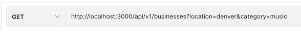
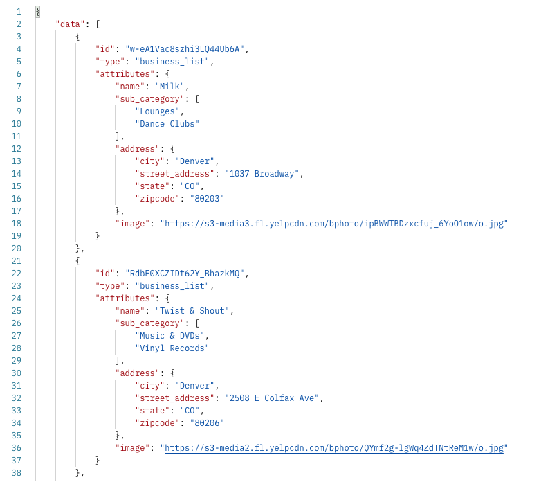
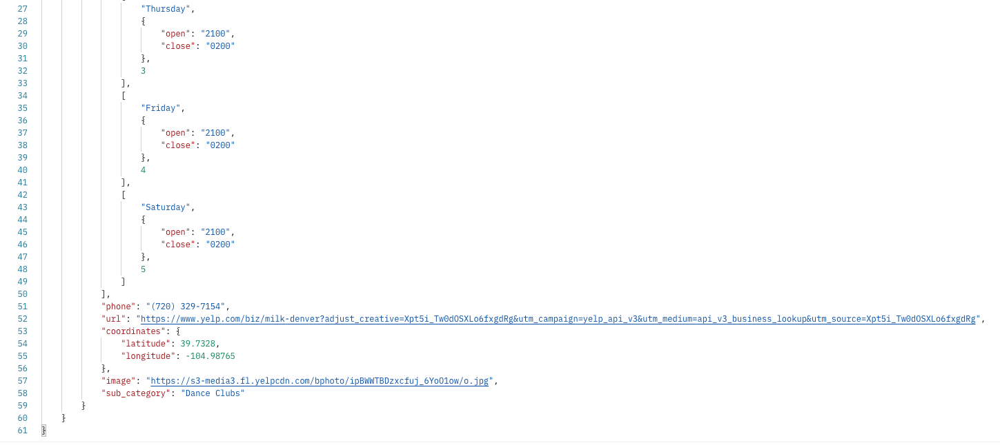

# Module 4 Capstone Back End Group Project
# DiverCity: Inclusive Business Guide API Endpoints

  
Table of Contents

  <ol>
    <li>
      <a href="#getting-started">Getting Started</a>
      <ul>
        <li><a href="#set-up">Set Up</a></li>
        <li><a href="#versions">Versions</a></li>
        <li><a href="#gems">Important Gems</a></li>
        <li><a href="#use-of-this-repository">Use of this Repository</a>
          <ul>
            <li>Frontend Server</li>
            <li>Backend Server</li>
          </ul>
        </li>
    </li>
    </ul>
    <li>
      <a href="#project-description">About This Project</a>
      <ul>
        <li><a href="#learning-goals-for-project">Learning Goals for Project</a></li>
      </ul>
    </li>
    <li>
      <a href="#apis">Book Club API</a>
      

        
Available Endpoints

        <ul>
          <li><a href="#backgrounds-endpoints">Backgrounds Endpoints</a></li>
          <li><a href="#book-search-endpoints">Book Search Endpoints</a></li>
          <li><a href="#forecast-endpoints">Forecast Endpoints</a></li>
          <li><a href="#road-trip-endpoints">Road Trip Endpoints</a></li>
          <li><a href="#sessions-endpoints">Sessions Endpoints</a></li>
          <li><a href="#users-endpoints">Users Endpoints</a></li>
        </ul>
      

    </li>
    <li><a href="#collaborators">Collaborators</a></li>
  </ol>

----------

## Getting Started

### Versions

- Ruby 2.7.2
- Rails 5.2.8

----------

### Gems

API | [jsonapi-serializer](https://github.com/fotinakis/jsonapi-serializers), [faraday](https://github.com/lostisland/faraday), [figaro] (https://medium.com/@MinimalGhost/the-figaro-gem-an-easier-way-to-securely-configure-rails-applications-c6f963b7e993)

CI/CD | [GitHub Actions](https://docs.rubocop.org/rubocop/index.html](https://github.com/features/actions), [Rubocop](https://docs.rubocop.org/rubocop/index.html)

Testing | [rspec-rails](https://github.com/rspec/rspec-rails), [simplecov](https://github.com/simplecov-ruby/simplecov), [factory_bot_rails](https://github.com/thoughtbot/factory_bot_rails), [faker](https://github.com/vajradog/faker-rails), [webmock](https://github.com/bblimke/webmock), [shoulda-matchers](https://github.com/thoughtbot/shoulda-matchers)

----------

### Set Up

## The Index

## The Business Show Page

## Posting Recommendations

## Get Businesses Recommendations
